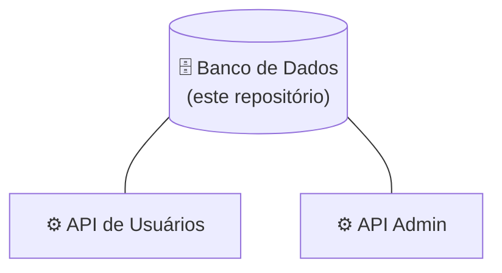

# 🗄️ VibeEco-DataBase

<p align="center">
  <strong>Banco de Dados da plataforma VibeEco</strong>
</p>

---

## 📌 Sobre este repositório

Este repositório contém a **modelagem e a implementação do banco de dados** do VibeEco. Ele é a base de dados compartilhada pelas duas APIs da plataforma: a **API de Usuários** e a **API Administrativa**.

**Responsável:** Ryller Feitosa — [GitHub](https://github.com/ryllerfeitosadba)

---

## 🏗️ Posição na arquitetura



---

## 🎯 Responsabilidades

- Modelo conceitual;
- Modelo lógico;
- Modelo físico;
- Criação das tabelas;
- Chaves primárias;
- Chaves estrangeiras;
- Relacionamentos;
- Restrições;
- Scripts do banco;
- Validação da estrutura.

---

## 🔄 Etapas de desenvolvimento

```text
Modelo Conceitual
       ↓
Modelo Lógico
       ↓
Modelo Físico
       ↓
Implementação
       ↓
Validação
```

### Modelo Conceitual

- Levantamento das entidades;
- Definição dos atributos;
- Definição dos relacionamentos;
- Definição das cardinalidades;
- Revisão do modelo.

### Modelo Lógico

- Transformação das entidades em tabelas;
- Definição das chaves primárias e estrangeiras;
- Definição dos atributos e tipos de dados;
- Revisão do modelo.

### Modelo Físico

- Criação do banco e das tabelas;
- Criação das chaves, restrições e relacionamentos;
- Configuração do banco.

---

## 🗂️ Domínios de dados

O banco deve dar suporte às funcionalidades da plataforma:

- Usuários e administradores (autenticação, permissões);
- Perfil e histórico de atividades;
- Feed, publicações, curtidas e comentários;
- Missões e desafios;
- Conteúdos educativos e quiz;
- Gamificação: XP, níveis, Moedas Verdes, conquistas e ranking;
- Recompensas;
- Notificações.

<!-- TODO: listar as tabelas reais assim que o modelo físico estiver fechado -->

---

## 📁 Estrutura do repositório

<!-- TODO: ajustar conforme a estrutura real -->

```text
VibeEco-DataBase
│
├── 📁 modelagem      # Modelos conceitual e lógico (diagramas)
├── 📁 scripts        # Scripts de criação das tabelas, chaves e restrições
├── 📁 dados          # Dados iniciais (seeds), se houver
└── 📄 README.md
```

---

## ⚙️ Como executar

<!-- TODO: informar o SGBD utilizado e a versão -->

1. Instale o SGBD utilizado pelo projeto: `<SGBD e versão>`;
2. Crie o banco de dados: `<nome do banco>`;
3. Execute os scripts de criação da pasta `scripts`, na ordem indicada;
4. (Opcional) Execute os scripts de dados iniciais;
5. Valide a estrutura criada.

---

## 🧪 Testes e validação

- Testes da estrutura;
- Testes dos relacionamentos;
- Testes das restrições;
- Validação dos dados.

---

## 🔐 Segurança

- Não versionar credenciais nem dados reais de usuários;
- Usar usuários de banco com o mínimo de permissões necessárias;
- Armazenar senhas apenas de forma protegida (hash).

---

## 📊 Status

🚧 **Em desenvolvimento**

- [ ] Modelo conceitual
- [ ] Modelo lógico
- [ ] Modelo físico
- [ ] Implementação
- [ ] Validação

---

## 🌱 Sobre o VibeEco

O **VibeEco** é uma plataforma digital desenvolvida pela **TechProton** para promover a conscientização e o engajamento em sustentabilidade, por meio de conteúdos educativos, missões, desafios, gamificação e interação social.

🔗 **Repositório principal:** [VibeEco](https://github.com/pedsousa06-ai/VibeEco)

### 📦 Repositórios do projeto

| Área | Repositório | Responsável |
|------|-------------|-------------|
| 🗄️ Banco de Dados | [VibeEco-DataBase](https://github.com/pedsousa06-ai/VibeEco-DataBase) | Ryller Feitosa |
| ⚙️ Back-end Usuários | [VibeEco-Back-End-Users](https://github.com/pedsousa06-ai/VibeEco-Back-End-Users) | Lucas Kolle |
| ⚙️ Back-end Administrativo | [VibeEco-Back-End-Adm](https://github.com/pedsousa06-ai/VibeEco-Back-End-Adm) | Lucas Kolle |
| 🖥️ Front-end Usuários | [VibeEco-Front-End-Users](https://github.com/pedsousa06-ai/VibeEco-Front-End-Users) | Gabriel Sousa |
| 🖥️ Front-end Administrativo | [VibeEco-Front-End-Adm](https://github.com/pedsousa06-ai/VibeEco-Front-End-Adm) | Gabriel Sousa |
| 📱 Mobile | [VibeEco-Mobile](https://github.com/pedsousa06-ai/VibeEco-Mobile) | Pedro Sousa |

---

## 📄 Licença

Este projeto foi desenvolvido pela equipe TechProton como parte do projeto VibeEco. Informações sobre licenciamento e distribuição deverão ser definidas pela equipe responsável pelo projeto.

## 👨‍💻 TechProton

| | |
|---|---|
| **Projeto** | VibeEco |
| **Empresa** | TechProton |
| **Categoria** | Tecnologia • Sustentabilidade • Educação |
| **Status** | Em desenvolvimento |
| **Início** | 10/08/2026 |
